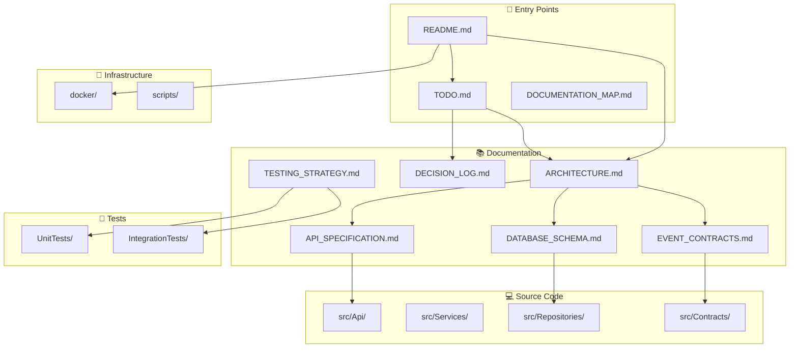

# Volue Forecast Service - Documentation Map

**Generated:** 2026-01-30  
**Total Files:** 35+  
**Mermaid Diagrams:** 15+  
**Author:** Neslihan Korkmaz  

---

## Purpose

This document provides a comprehensive map of all Forecast Service documentation:

- Complete file tree with descriptions
- Cross-reference matrix showing document relationships
- Quick reference guide by topic and role
- File statistics

---

## Table of Contents

1. [Complete File Tree](#complete-file-tree)
2. [File Statistics](#file-statistics)
3. [Cross-Reference Matrix](#cross-reference-matrix)
4. [Documentation Structure Diagram](#documentation-structure-diagram)
5. [Quick Reference by Topic](#quick-reference-by-topic)
6. [Quick Reference by Role](#quick-reference-by-role)

---

## Complete File Tree

```
volue-forecast-service/
│
├── 📄 README.md ...................... Main documentation, quick start
├── 📄 TODO.md ........................ Master task list with phases
├── 📄 DOCUMENTATION_MAP.md ........... This file - complete navigation
├── 📄 .gitignore ..................... Git ignore rules
├── 📄 .editorconfig .................. Code style configuration
├── 📄 .dockerignore .................. Docker build ignore rules
├── 📄 global.json .................... .NET SDK version pinning
├── 📄 Directory.Build.props .......... Shared MSBuild properties
├── 📄 Volue.ForecastService.sln ...... Solution file
│
├── 📁 docs/
│   ├── 📄 ARCHITECTURE.md ............ System architecture + diagrams
│   ├── 📄 DECISION_LOG.md ............ Technology decisions + rationale
│   ├── 📄 API_SPECIFICATION.md ....... OpenAPI spec documentation
│   ├── 📄 DATABASE_SCHEMA.md ......... Schema design + indexes
│   ├── 📄 EVENT_CONTRACTS.md ......... Event payload specifications
│   └── 📄 TESTING_STRATEGY.md ........ Test pyramid + coverage
│
├── 📁 src/
│   │
│   ├── 📁 Volue.ForecastService.Api/ ........... Presentation Layer
│   │   ├── 📁 Controllers/
│   │   │   ├── 📄 ForecastsController.cs ....... PUT/GET forecasts
│   │   │   ├── 📄 PositionsController.cs ....... GET company position
│   │   │   └── 📄 HealthController.cs .......... Health endpoints
│   │   ├── 📁 Middleware/
│   │   │   ├── 📄 CorrelationIdMiddleware.cs ... Request correlation
│   │   │   └── 📄 ExceptionHandlingMiddleware.cs Global error handler
│   │   ├── 📄 Program.cs ....................... Application bootstrap
│   │   ├── 📄 appsettings.json ................. Base configuration
│   │   └── 📄 appsettings.Development.json ..... Dev overrides
│   │
│   ├── 📁 Volue.ForecastService.Services/ ...... Application Layer
│   │   ├── 📁 UseCases/
│   │   │   ├── 📄 CreateOrUpdateForecastUseCase.cs
│   │   │   ├── 📄 GetForecastUseCase.cs
│   │   │   └── 📄 GetCompanyPositionUseCase.cs
│   │   ├── 📁 Validation/
│   │   │   └── 📄 ForecastValidator.cs ......... Business rules
│   │   └── 📁 Events/
│   │       └── 📄 PositionChangedPublisher.cs .. Event publishing
│   │
│   ├── 📁 Volue.ForecastService.Repositories/ .. Infrastructure Layer
│   │   ├── 📁 Persistence/
│   │   │   ├── 📄 ForecastDbContext.cs ......... EF Core context
│   │   │   ├── 📄 ForecastConfiguration.cs ..... Entity config
│   │   │   └── 📄 PowerPlantConfiguration.cs ... Entity config
│   │   ├── 📁 Implementations/
│   │   │   ├── 📄 ForecastRepository.cs ........ UPSERT logic
│   │   │   └── 📄 PositionRepository.cs ........ Aggregation queries
│   │   └── 📁 Migrations/
│   │       └── 📄 *.cs ......................... EF Core migrations
│   │
│   └── 📁 Volue.ForecastService.Contracts/ ..... Shared Layer
│       ├── 📁 DTOs/
│       │   ├── 📄 ForecastRequest.cs ........... API request models
│       │   ├── 📄 ForecastResponse.cs .......... API response models
│       │   └── 📄 PositionResponse.cs .......... Position aggregation
│       ├── 📁 Events/
│       │   └── 📄 PositionChangedEvent.cs ...... Event contract
│       ├── 📁 Interfaces/
│       │   ├── 📄 IForecastRepository.cs ....... Repository contracts
│       │   └── 📄 IEventPublisher.cs ........... Event contracts
│       └── 📁 Common/
│           ├── 📄 Result.cs .................... Result pattern
│           └── 📄 DomainErrors.cs .............. Error definitions
│
├── 📁 tests/
│   ├── 📁 Volue.ForecastService.UnitTests/
│   │   ├── 📁 Services/
│   │   │   └── 📄 ForecastUseCaseTests.cs
│   │   ├── 📁 Validation/
│   │   │   └── 📄 ForecastValidatorTests.cs
│   │   └── 📁 Domain/
│   │       └── 📄 ForecastEntityTests.cs
│   │
│   └── 📁 Volue.ForecastService.IntegrationTests/
│       ├── 📁 Api/
│       │   ├── 📄 ForecastsEndpointTests.cs
│       │   └── 📄 PositionsEndpointTests.cs
│       └── 📁 Infrastructure/
│           └── 📄 DatabaseTests.cs
│
├── 📁 docker/
│   ├── 📄 Dockerfile ................. Multi-stage build
│   ├── 📄 docker-compose.yml ......... Full stack
│   └── 📄 init-db.sql ................ Database initialization
│
└── 📁 scripts/
    ├── 📄 init-project.ps1 ........... Project scaffolding
    ├── 📄 setup-docker.ps1 ........... Docker configuration
    └── 📄 run-tests.ps1 .............. Test execution
```

---

## File Statistics

### Overview by Category

| Category | Files | Purpose |
|----------|-------|---------|
| **docs/** | 6 | Architecture, decisions, specifications |
| **src/Api** | 8 | HTTP layer, controllers, middleware |
| **src/Services** | 5 | Business logic, use cases |
| **src/Repositories** | 6 | Data access, EF Core |
| **src/Contracts** | 8 | DTOs, events, interfaces |
| **tests/** | 6 | Unit and integration tests |
| **docker/** | 3 | Containerization |
| **scripts/** | 3 | Automation |
| **Root** | 7 | Config, solution |

### Key Documentation Files

| File | Description | Read Time |
|------|-------------|-----------|
| ARCHITECTURE.md | System design + diagrams | 30-40 min |
| DECISION_LOG.md | Technology rationale | 15-20 min |
| API_SPECIFICATION.md | Endpoint documentation | 20-25 min |
| DATABASE_SCHEMA.md | Schema + indexes | 15-20 min |
| TODO.md | Complete task breakdown | 10-15 min |

---

## Cross-Reference Matrix

### Document Relationships

```
README.md (entry point)
    ├──► docs/ARCHITECTURE.md
    ├──► docs/DECISION_LOG.md
    ├──► TODO.md
    └──► docker/docker-compose.yml

docs/ARCHITECTURE.md (hub)
    ├──► docs/DATABASE_SCHEMA.md
    ├──► docs/EVENT_CONTRACTS.md
    ├──► src/Services/
    └──► src/Repositories/

docs/API_SPECIFICATION.md
    ├──► src/Api/Controllers/
    ├──► src/Contracts/DTOs/
    └──► docs/ARCHITECTURE.md

docs/DATABASE_SCHEMA.md
    ├──► src/Repositories/Persistence/
    ├──► src/Repositories/Migrations/
    └──► docs/ARCHITECTURE.md

TODO.md
    ├──► All phases reference specific files
    ├──► scripts/ for automation
    └──► tests/ for verification
```

### Component Dependencies

```
┌─────────────────────────────────────────────────────────────┐
│                        API Layer                             │
│  ┌─────────────┐  ┌─────────────┐  ┌─────────────────────┐ │
│  │ Controllers │  │ Middleware  │  │ Program.cs          │ │
│  └──────┬──────┘  └─────────────┘  └─────────────────────┘ │
│         │                                                    │
├─────────┼────────────────────────────────────────────────────┤
│         ▼                                                    │
│                     Services Layer                           │
│  ┌─────────────┐  ┌─────────────┐  ┌─────────────────────┐ │
│  │  UseCases   │  │ Validation  │  │ Event Publishing    │ │
│  └──────┬──────┘  └─────────────┘  └─────────────────────┘ │
│         │                                                    │
├─────────┼────────────────────────────────────────────────────┤
│         ▼                                                    │
│                   Repositories Layer                         │
│  ┌─────────────┐  ┌─────────────┐  ┌─────────────────────┐ │
│  │  DbContext  │  │Repositories │  │ Migrations          │ │
│  └──────┬──────┘  └─────────────┘  └─────────────────────┘ │
│         │                                                    │
├─────────┼────────────────────────────────────────────────────┤
│         ▼                                                    │
│                    Contracts Layer                           │
│  ┌─────────────┐  ┌─────────────┐  ┌─────────────────────┐ │
│  │    DTOs     │  │   Events    │  │ Interfaces          │ │
│  └─────────────┘  └─────────────┘  └─────────────────────┘ │
└─────────────────────────────────────────────────────────────┘
```

---

## Documentation Structure Diagram



---

## Quick Reference by Topic

### 🏗️ Architecture & Design

| Document | Key Topics | Priority |
|----------|------------|----------|
| ARCHITECTURE.md | Layers, data flow, diagrams | ⭐⭐⭐ |
| DECISION_LOG.md | Tech choices, rationale | ⭐⭐⭐ |
| DATABASE_SCHEMA.md | Tables, indexes, constraints | ⭐⭐ |

### 🔌 API Development

| Document | Key Topics | Priority |
|----------|------------|----------|
| API_SPECIFICATION.md | Endpoints, request/response | ⭐⭐⭐ |
| src/Api/Controllers/ | Implementation | ⭐⭐⭐ |
| src/Contracts/DTOs/ | Data models | ⭐⭐ |

### 📨 Event-Driven

| Document | Key Topics | Priority |
|----------|------------|----------|
| EVENT_CONTRACTS.md | Event schemas | ⭐⭐ |
| src/Contracts/Events/ | Event classes | ⭐⭐ |
| src/Services/Events/ | Publishing logic | ⭐⭐ |

### 🧪 Testing

| Document | Key Topics | Priority |
|----------|------------|----------|
| TESTING_STRATEGY.md | Test pyramid, coverage | ⭐⭐ |
| tests/UnitTests/ | Service tests | ⭐⭐⭐ |
| tests/IntegrationTests/ | API tests | ⭐⭐⭐ |

### 🐳 DevOps

| Document | Key Topics | Priority |
|----------|------------|----------|
| docker/ | Containerization | ⭐⭐⭐ |
| scripts/ | Automation | ⭐⭐ |
| TODO.md | Phase 3 (Docker) | ⭐⭐⭐ |

---

## Quick Reference by Role

### 🎯 Interviewer / Reviewer

**Quick Review (15 minutes):**
1. README.md - Project overview
2. TODO.md - Scope understanding
3. DECISION_LOG.md - Technical thinking

**Deep Review (45 minutes):**
1. ARCHITECTURE.md - System design
2. API_SPECIFICATION.md - API contracts
3. src/Services/ - Business logic quality

### 👨‍💻 Developer (Self - Implementation)

**Phase Order:**
1. TODO.md - Follow phases 1-11
2. scripts/init-project.ps1 - Bootstrap
3. scripts/setup-docker.ps1 - Infrastructure
4. Implement phase by phase

**Key Implementation Files:**
1. src/Repositories/ForecastRepository.cs - UPSERT logic
2. src/Services/UseCases/*.cs - Business logic
3. src/Api/Controllers/*.cs - HTTP endpoints

### 🏛️ Architect (Design Review)

**Design Validation:**
1. ARCHITECTURE.md - System coherence
2. DATABASE_SCHEMA.md - Data model
3. EVENT_CONTRACTS.md - Integration points
4. DECISION_LOG.md - Trade-offs

---

## Validation Summary

| Metric | Target | Status |
|--------|--------|--------|
| Documentation files | 6+ | ⬜ |
| Mermaid diagrams | 10+ | ⬜ |
| Code files | 30+ | ⬜ |
| Test coverage | 80%+ | ⬜ |
| All TODO phases | 11 | ⬜ |

---

## Maintenance

### When Adding New Features

1. Update TODO.md with new tasks
2. Update DOCUMENTATION_MAP.md
3. Add Mermaid diagrams if needed
4. Update API_SPECIFICATION.md if new endpoints
5. Add tests

### When Changing Architecture

1. Update ARCHITECTURE.md
2. Update relevant diagrams
3. Update DECISION_LOG.md with rationale
4. Review cross-references

---

*Document Version: 1.0*  
*Last Updated: 2026-01-30*  
*Author: Neslihan Korkmaz*
