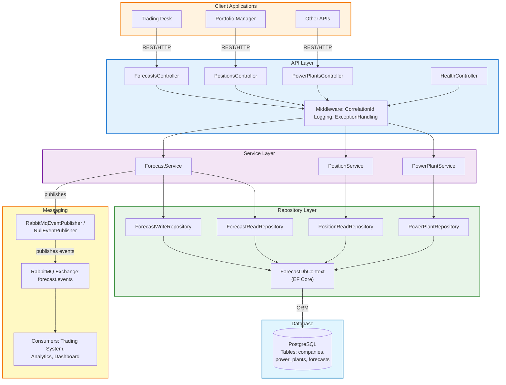
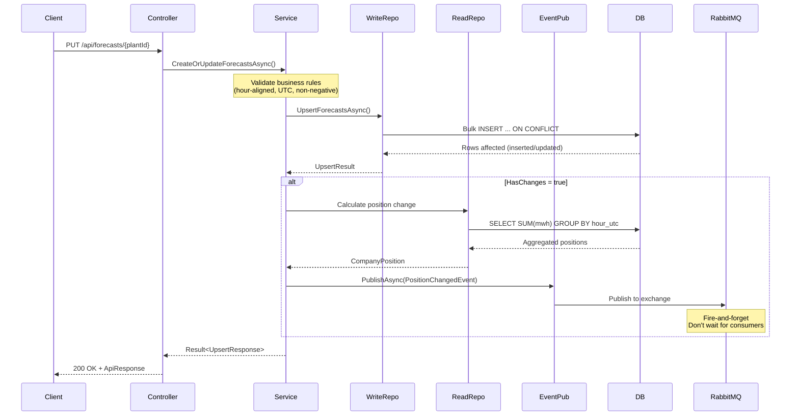
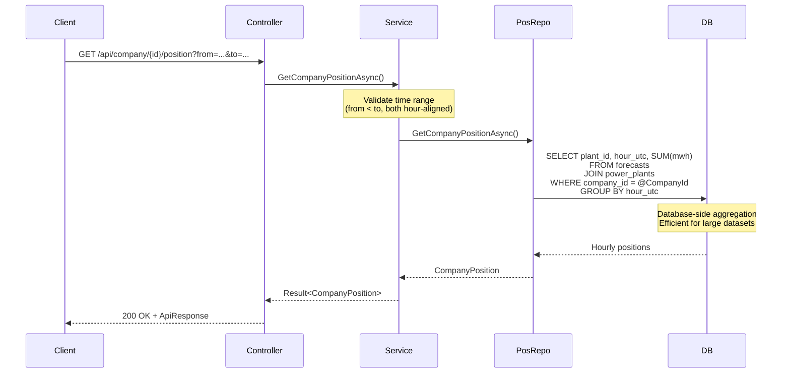
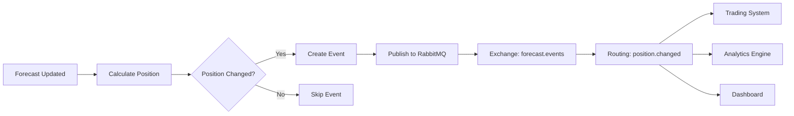
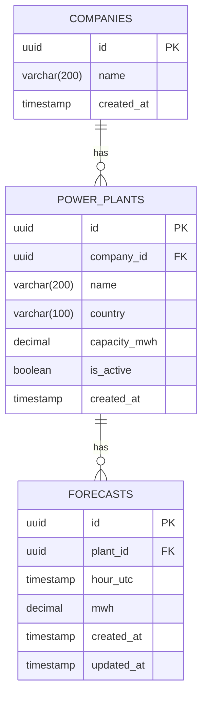

# Architecture Documentation
**Volue Forecast Service**  
**Version:** 1.0  
**Last Updated:** January 30, 2026

---

## Table of Contents

1. [System Overview](#system-overview)
2. [Architectural Patterns](#architectural-patterns)
3. [Layered Architecture](#layered-architecture)
4. [Data Flow](#data-flow)
5. [Component Details](#component-details)
6. [Database Schema](#database-schema)
7. [Event Architecture](#event-architecture)
8. [API Design](#api-design)
9. [Security Considerations](#security-considerations)

---

## System Overview

### High-Level Architecture




### Design Principles

1. **Separation of Concerns**: Clear boundaries between presentation, business logic, and data access
2. **Dependency Inversion**: Depend on abstractions (interfaces), not concrete implementations
3. **Single Responsibility**: Each component has one reason to change
4. **Open/Closed**: Open for extension, closed for modification
5. **DRY (Don't Repeat Yourself)**: Shared logic in reusable components
6. **Fail-Fast**: Validate early and provide clear error messages

### Key Architectural Decisions

| Decision | Rationale | Trade-offs |
|----------|-----------|------------|
| **Layered Architecture** | Clear separation, testability, maintainability | Slight overhead for simple operations |
| **Result Pattern** | Type-safe error handling without exceptions | More verbose than exception handling |
| **CQRS-Lite** | Separate read/write repositories for optimization | Not full CQRS (no separate read models) |
| **Bulk UPSERT** | 100x performance improvement | More complex SQL, PostgreSQL-specific |
| **Event-Driven** | Decoupled, scalable, async communication | Eventual consistency, debugging complexity |
| **Graceful Degradation** | System works without RabbitMQ | Events are lost (not persisted) |

---

## Architectural Patterns

### 1. Clean Architecture (Layered)

```
┌─────────────────────────────────────────────────┐
│         Presentation Layer (API)                │
│  - Controllers                                  │
│  - Middleware                                   │
│  - DTOs (Request/Response)                      │
└────────────────┬────────────────────────────────┘
                 │ depends on ↓
┌────────────────▼────────────────────────────────┐
│         Application Layer (Services)            │
│  - Business Logic                               │
│  - Orchestration                                │
│  - Validation                                   │
└────────────────┬────────────────────────────────┘
                 │ depends on ↓
┌────────────────▼────────────────────────────────┐
│         Domain Layer (Contracts)                │
│  - Entities/Models                              │
│  - Interfaces                                   │
│  - Domain Events                                │
└────────────────┬────────────────────────────────┘
                 │ depends on ↓
┌────────────────▼────────────────────────────────┐
│      Infrastructure Layer (Repositories)        │
│  - Data Access                                  │
│  - External Services                            │
│  - EF Core                                      │
└─────────────────────────────────────────────────┘
```

**Dependencies flow inward:**
- API Layer → Service Layer
- Service Layer → Domain Layer (Contracts)
- Repository Layer → Domain Layer (Contracts)

**No circular dependencies**: Infrastructure (Repository) knows about Domain, but Domain doesn't know about Infrastructure.

### 2. Repository Pattern

**Purpose**: Abstract data access logic from business logic.

```csharp
// Interface (in Domain/Contracts)
public interface IForecastWriteRepository
{
    Task<UpsertResult> UpsertForecastsAsync(Guid plantId, IEnumerable<ForecastPoint> forecasts);
}

// Implementation (in Infrastructure/Repositories)
public class ForecastWriteRepository : IForecastWriteRepository
{
    private readonly ForecastDbContext _context;
    
    public async Task<UpsertResult> UpsertForecastsAsync(Guid plantId, IEnumerable<ForecastPoint> forecasts)
    {
        // PostgreSQL-specific bulk UPSERT
        // Business logic doesn't know about implementation
    }
}
```

**Benefits:**
- Testability: Mock repositories in unit tests
- Flexibility: Swap implementations (e.g., SQL → NoSQL)
- Separation: Business logic doesn't depend on EF Core

### 3. Result Pattern

**Purpose**: Type-safe error handling without exceptions for business logic.

```csharp
public class Result<T>
{
    public bool Success { get; }
    public T? Data { get; }
    public Error? Error { get; }
    
    public static Result<T> Ok(T data) => new(data);
    public static Result<T> Fail(string code, string message) => new(code, message);
}

// Usage
public async Task<Result<UpsertResponse>> CreateOrUpdateForecastsAsync(...)
{
    // Validation
    if (!IsValidTimeRange(...))
        return Result<UpsertResponse>.Fail("Forecast.InvalidTimeRange", "...");
    
    // Business logic
    var result = await _writeRepository.UpsertForecastsAsync(...);
    
    return Result<UpsertResponse>.Ok(result);
}
```

**Benefits:**
- No try-catch for business validation
- Explicit success/failure handling
- Type-safe error codes
- Clear API contracts

### 4. CQRS-Lite (Command Query Responsibility Segregation)

**Simplified CQRS**: Separate repositories for reads and writes, but same database.

```
Commands (Writes)          Queries (Reads)
      ↓                          ↓
ForecastWriteRepository    ForecastReadRepository
      ↓                          ↓
      └──────→ PostgreSQL ←──────┘
```

**Write Repository** (optimized for UPSERT):
```csharp
public class ForecastWriteRepository
{
    public async Task<UpsertResult> UpsertForecastsAsync(...)
    {
        // Bulk INSERT ... ON CONFLICT DO UPDATE
        // Optimized for write performance
    }
}
```

**Read Repository** (optimized for queries):
```csharp
public class ForecastReadRepository
{
    public async Task<IEnumerable<Forecast>> GetForecastsAsync(...)
    {
        return await _context.Forecasts
            .AsNoTracking() // Read-only, no change tracking
            .Where(f => f.PlantId == plantId && ...)
            .ToListAsync();
    }
}
```

**Benefits:**
- Write optimization: Bulk operations, no tracking
- Read optimization: AsNoTracking, compiled queries
- Different scaling strategies (more reads than writes)

### 5. Event-Driven Architecture

**Pattern**: Publish events when company position changes.

```
Forecast Updated
       ↓
Calculate Position Change
       ↓
Publish PositionChangedEvent
       ↓
RabbitMQ (Exchange: forecast.events)
       ↓
Multiple Consumers
  ↓         ↓         ↓
Trading  Analytics  Dashboard
```

**Event Publishing (Fire-and-Forget):**
```csharp
public interface IEventPublisher
{
    Task PublishAsync<T>(T eventData) where T : class;
}

// RabbitMQ implementation
public class RabbitMqEventPublisher : IEventPublisher
{
    public async Task PublishAsync<T>(T eventData)
    {
        // Publish to RabbitMQ exchange
        // Don't wait for consumers
    }
}

// Null implementation (graceful degradation)
public class NullEventPublisher : IEventPublisher
{
    public Task PublishAsync<T>(T eventData)
    {
        // Do nothing, system still works
        return Task.CompletedTask;
    }
}
```

**Dependency Injection (based on config):**
```csharp
if (configuration.GetValue<bool>("RabbitMQ:Enabled"))
    services.AddSingleton<IEventPublisher, RabbitMqEventPublisher>();
else
    services.AddSingleton<IEventPublisher, NullEventPublisher>();
```

---

## Layered Architecture

### Layer 1: API Layer (Presentation)

**Responsibility**: HTTP endpoints, request/response handling, middleware.

**Components:**
- **Controllers**: HTTP endpoints (REST)
- **Middleware**: Cross-cutting concerns (logging, correlation ID, exception handling)
- **DTOs**: Request/Response models

**Example Controller:**
```csharp
[ApiController]
[Route("api/forecasts")]
public class ForecastsController : ControllerBase
{
    private readonly IForecastService _forecastService;
    
    [HttpPut("{plantId}")]
    public async Task<IActionResult> CreateOrUpdate(
        Guid plantId,
        [FromBody] CreateOrUpdateForecastRequest request)
    {
        var result = await _forecastService.CreateOrUpdateForecastsAsync(plantId, request.Forecasts);
        
        return result.Success 
            ? Ok(ApiResponse<UpsertResponse>.Success(result.Data))
            : BadRequest(ApiResponse<UpsertResponse>.Failure(result.Error));
    }
}
```

**Middleware Pipeline:**
```
HTTP Request
    ↓
1. CorrelationIdMiddleware (add X-Correlation-ID)
    ↓
2. ExceptionHandlingMiddleware (catch unhandled exceptions)
    ↓
3. Logging (Serilog structured logging)
    ↓
4. Controller Action
    ↓
HTTP Response
```

### Layer 2: Service Layer (Application)

**Responsibility**: Business logic, validation, orchestration.

**Components:**
- **ForecastService**: Forecast validation and orchestration
- **PositionService**: Position aggregation logic
- **PowerPlantService**: Metadata operations
- **Event Publisher**: Event publishing abstraction

**Example Service:**
```csharp
public class ForecastService : IForecastService
{
    private readonly IForecastWriteRepository _writeRepository;
    private readonly IForecastReadRepository _readRepository;
    private readonly IEventPublisher _eventPublisher;
    private readonly ILogger<ForecastService> _logger;
    
    public async Task<Result<UpsertResponse>> CreateOrUpdateForecastsAsync(
        Guid plantId, 
        IEnumerable<ForecastPoint> forecasts)
    {
        // 1. Validate business rules
        if (!IsValidTimeRange(forecasts))
            return Result<UpsertResponse>.Fail("Forecast.InvalidTimeRange", "...");
        
        // 2. Execute repository operation
        var result = await _writeRepository.UpsertForecastsAsync(plantId, forecasts);
        
        // 3. Publish event (if position changed)
        if (result.HasChanges)
        {
            var position = await CalculatePositionAsync(plantId);
            await _eventPublisher.PublishAsync(new PositionChangedEvent { ... });
        }
        
        return Result<UpsertResponse>.Ok(result);
    }
}
```

### Layer 3: Domain Layer (Contracts)

**Responsibility**: Interfaces, models, domain events.

**Components:**
- **Interfaces**: Service and repository contracts
- **Models**: Domain entities (Company, PowerPlant, Forecast)
- **DTOs**: Data transfer objects
- **Events**: Domain events (PositionChangedEvent)

**Example Interface:**
```csharp
public interface IForecastService
{
    Task<Result<UpsertResponse>> CreateOrUpdateForecastsAsync(
        Guid plantId, 
        IEnumerable<ForecastPoint> forecasts);
    
    Task<Result<ForecastQueryResponse>> GetForecastsAsync(
        Guid plantId, 
        DateTime fromUtc, 
        DateTime toUtc);
}
```

### Layer 4: Infrastructure Layer (Repositories)

**Responsibility**: Data access, external services, EF Core.

**Components:**
- **Repositories**: Data access implementations
- **DbContext**: EF Core database context
- **Migrations**: Database schema changes
- **Entity Configurations**: Fluent API configurations

**Example Repository:**
```csharp
public class ForecastWriteRepository : IForecastWriteRepository
{
    private readonly ForecastDbContext _context;
    
    public async Task<UpsertResult> UpsertForecastsAsync(
        Guid plantId, 
        IEnumerable<ForecastPoint> forecasts)
    {
        // PostgreSQL bulk UPSERT using raw SQL
        var sql = @"
            INSERT INTO forecasts (id, plant_id, hour_utc, mwh, created_at, updated_at)
            VALUES (@Id, @PlantId, @HourUtc, @Mwh, @CreatedAt, @UpdatedAt)
            ON CONFLICT (plant_id, hour_utc)
            DO UPDATE SET
                mwh = EXCLUDED.mwh,
                updated_at = EXCLUDED.updated_at
            WHERE forecasts.mwh <> EXCLUDED.mwh;
        ";
        
        // Execute with parameters
        await _context.Database.ExecuteSqlRawAsync(sql, parameters);
        
        return new UpsertResult { ... };
    }
}
```

---

## Data Flow

### 1. Create/Update Forecast Flow



### 2. Get Company Position Flow



### 3. Event Publishing Flow



**Event Schema:**
```json
{
  "companyId": "11111111-1111-1111-1111-111111111111",
  "companyName": "Energy Trading Corp",
  "positions": [
    {
      "hourUtc": "2026-01-30T10:00:00Z",
      "totalMwh": 580.0,
      "plantCount": 3
    }
  ],
  "totalMwh": 1176.25,
  "changedAt": "2026-01-30T12:34:56Z",
  "correlationId": "demo-request-001"
}
```

---

## Component Details

### ForecastService

**Responsibilities:**
- Validate forecast business rules
- Orchestrate forecast operations
- Calculate position changes
- Publish position change events

**Key Methods:**
```csharp
Task<Result<UpsertResponse>> CreateOrUpdateForecastsAsync(Guid plantId, IEnumerable<ForecastPoint> forecasts);
Task<Result<ForecastQueryResponse>> GetForecastsAsync(Guid plantId, DateTime fromUtc, DateTime toUtc);
```

**Validation Rules:**
- Timestamps must be hour-aligned (minutes and seconds = 0)
- Timestamps must be UTC
- MWh values must be non-negative
- Plant must exist and be active
- Time range must be valid (from < to)

### PositionService

**Responsibilities:**
- Aggregate forecasts across plants
- Calculate company-wide positions
- Provide position analytics

**Key Methods:**
```csharp
Task<Result<CompanyPosition>> GetCompanyPositionAsync(Guid companyId, DateTime fromUtc, DateTime toUtc);
```

**Aggregation Logic:**
```sql
SELECT 
    f.hour_utc,
    SUM(f.mwh) as total_mwh,
    COUNT(DISTINCT f.plant_id) as plant_count
FROM forecasts f
JOIN power_plants p ON f.plant_id = p.id
WHERE p.company_id = @CompanyId
  AND f.hour_utc >= @FromUtc
  AND f.hour_utc < @ToUtc
  AND p.is_active = true
GROUP BY f.hour_utc
ORDER BY f.hour_utc;
```

### ForecastWriteRepository

**Responsibilities:**
- Bulk UPSERT operations
- Track inserted/updated/unchanged counts
- Optimize for write performance

**Bulk UPSERT Implementation:**
```csharp
public async Task<UpsertResult> UpsertForecastsAsync(Guid plantId, IEnumerable<ForecastPoint> forecasts)
{
    var parameters = new List<NpgsqlParameter>();
    var values = new List<string>();
    
    // Build bulk INSERT with ON CONFLICT
    var sql = $@"
        INSERT INTO forecasts (id, plant_id, hour_utc, mwh, created_at, updated_at)
        VALUES {string.Join(", ", values)}
        ON CONFLICT (plant_id, hour_utc)
        DO UPDATE SET
            mwh = EXCLUDED.mwh,
            updated_at = EXCLUDED.updated_at
        WHERE forecasts.mwh <> EXCLUDED.mwh;
    ";
    
    await _context.Database.ExecuteSqlRawAsync(sql, parameters.ToArray());
    
    // Calculate counts
    return new UpsertResult
    {
        InsertedCount = ...,
        UpdatedCount = ...,
        UnchangedCount = ...
    };
}
```

---

## Database Schema

### Entity-Relationship Diagram



### Table Schemas

**companies**
```sql
CREATE TABLE companies (
    id UUID PRIMARY KEY,
    name VARCHAR(200) NOT NULL,
    created_at TIMESTAMP NOT NULL DEFAULT NOW()
);
```

**power_plants**
```sql
CREATE TABLE power_plants (
    id UUID PRIMARY KEY,
    company_id UUID NOT NULL REFERENCES companies(id),
    name VARCHAR(200) NOT NULL,
    country VARCHAR(100) NOT NULL,
    capacity_mwh DECIMAL(10, 4) NOT NULL,
    is_active BOOLEAN NOT NULL DEFAULT true,
    created_at TIMESTAMP NOT NULL DEFAULT NOW(),
    
    CONSTRAINT fk_power_plants_company FOREIGN KEY (company_id) 
        REFERENCES companies(id) ON DELETE CASCADE
);

CREATE INDEX idx_power_plants_company ON power_plants(company_id);
CREATE INDEX idx_power_plants_active ON power_plants(is_active);
```

**forecasts**
```sql
CREATE TABLE forecasts (
    id UUID PRIMARY KEY,
    plant_id UUID NOT NULL REFERENCES power_plants(id),
    hour_utc TIMESTAMP NOT NULL,
    mwh DECIMAL(10, 4) NOT NULL CHECK (mwh >= 0),
    created_at TIMESTAMP NOT NULL DEFAULT NOW(),
    updated_at TIMESTAMP NOT NULL DEFAULT NOW(),
    
    CONSTRAINT fk_forecasts_plant FOREIGN KEY (plant_id) 
        REFERENCES power_plants(id) ON DELETE CASCADE,
    CONSTRAINT uq_forecasts_plant_hour UNIQUE (plant_id, hour_utc)
);

CREATE INDEX idx_forecasts_plant_time ON forecasts(plant_id, hour_utc);
CREATE INDEX idx_forecasts_time ON forecasts(hour_utc);
```

### Index Strategy

| Index | Purpose | Usage |
|-------|---------|-------|
| `idx_power_plants_company` | Filter by company | Position aggregation |
| `idx_power_plants_active` | Filter active plants | Validation |
| `idx_forecasts_plant_time` | Plant + time range queries | Get forecasts by plant |
| `idx_forecasts_time` | Time range queries | Company position |
| `uq_forecasts_plant_hour` | UPSERT uniqueness | Idempotency |

---

## Event Architecture

### RabbitMQ Configuration

**Exchange:**
- Name: `forecast.events`
- Type: `topic`
- Durable: `true`
- Auto-delete: `false`

**Routing Keys:**
- `position.changed` - Position change events

**Message Format:**
```json
{
  "companyId": "uuid",
  "companyName": "string",
  "positions": [
    {
      "hourUtc": "ISO-8601 datetime",
      "totalMwh": "decimal",
      "plantCount": "integer"
    }
  ],
  "totalMwh": "decimal",
  "changedAt": "ISO-8601 datetime",
  "correlationId": "string"
}
```

### Consumer Example

```csharp
public class PositionChangedConsumer
{
    public async Task HandleAsync(PositionChangedEvent evt)
    {
        // Trading system: update positions
        // Analytics: store for reporting
        // Dashboard: real-time updates
    }
}
```

---

## API Design

### RESTful Principles

- **Resource-based URLs**: `/api/forecasts/{plantId}`
- **HTTP verbs**: PUT (upsert), GET (query)
- **Standard status codes**: 200 OK, 400 Bad Request, 404 Not Found, 500 Internal Server Error
- **JSON request/response**: Content-Type: application/json
- **Correlation ID**: X-Correlation-ID header for distributed tracing

### Response Wrapper

```csharp
public class ApiResponse<T>
{
    public bool Success { get; set; }
    public T? Data { get; set; }
    public Error? Error { get; set; }
    
    public static ApiResponse<T> Success(T data) => new() { Success = true, Data = data };
    public static ApiResponse<T> Failure(Error error) => new() { Success = false, Error = error };
}
```

### Error Codes

| Code | Description | HTTP Status |
|------|-------------|-------------|
| `Forecast.InvalidHourAlignment` | Timestamp not hour-aligned | 400 |
| `Forecast.InvalidTimeRange` | Invalid from/to range | 400 |
| `Forecast.NegativeMwh` | Negative MWh value | 400 |
| `Plant.NotFound` | Power plant not found | 404 |
| `Plant.Inactive` | Power plant inactive | 400 |
| `Company.NotFound` | Company not found | 404 |
| `Internal.DatabaseError` | Database operation failed | 500 |

---

## Security Considerations

### Current Implementation
- **No authentication**: Suitable for internal microservice
- **Input validation**: Strong validation at service layer
- **SQL injection prevention**: Parameterized queries only
- **CORS**: Configured for development (allow all)

### Production Recommendations
- **Authentication**: Add JWT bearer tokens
- **Authorization**: Role-based access control (RBAC)
- **Rate limiting**: Prevent abuse
- **HTTPS only**: Enforce TLS
- **API keys**: For external clients
- **Audit logging**: Track all changes

---

**Last Updated:** January 30, 2026  
**Maintained By:** Neslihan Korkmaz  
**Version:** 1.0
