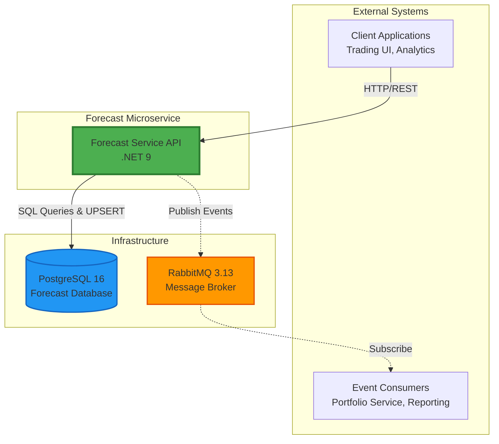
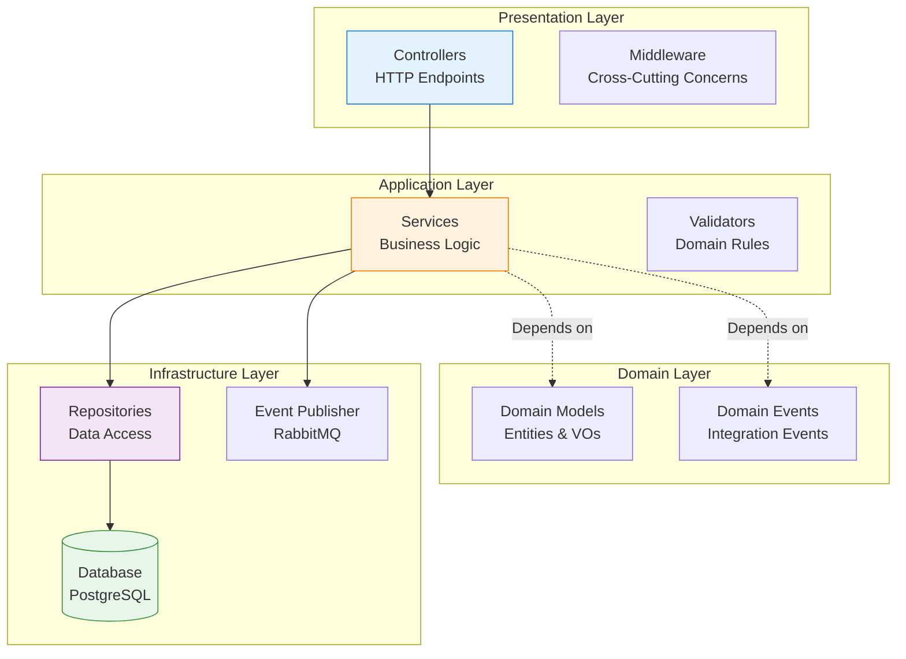
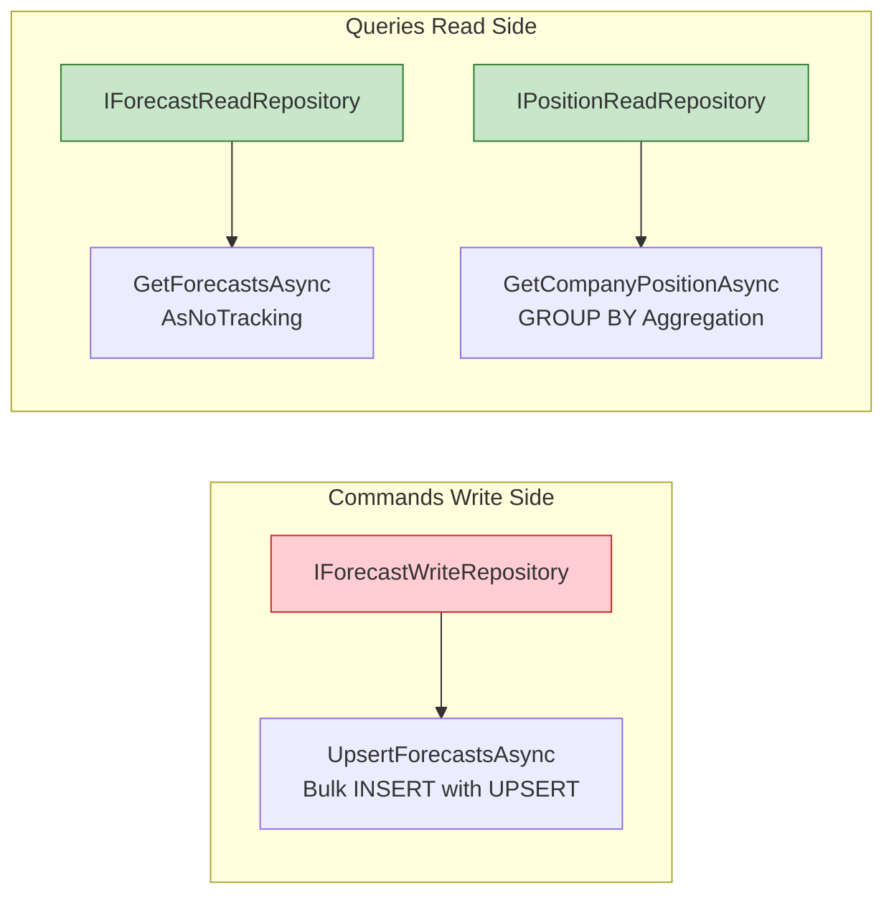
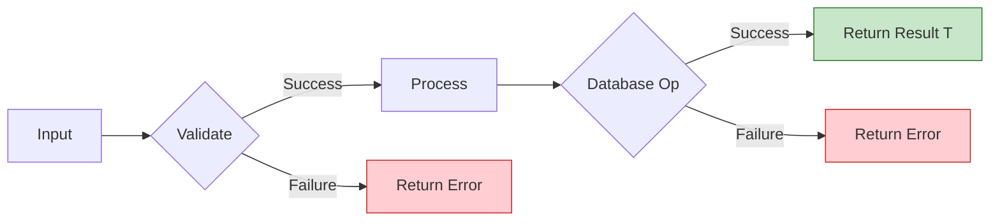
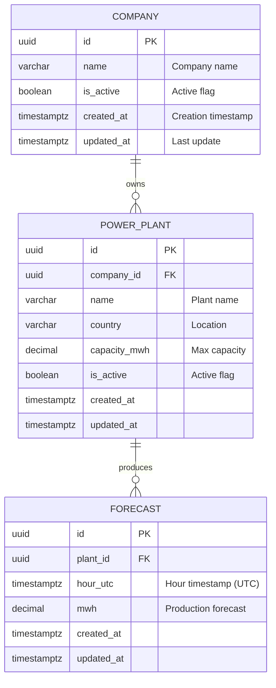
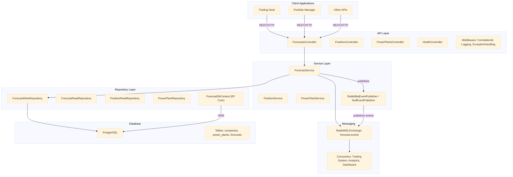
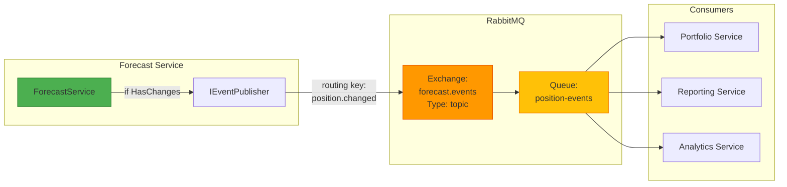
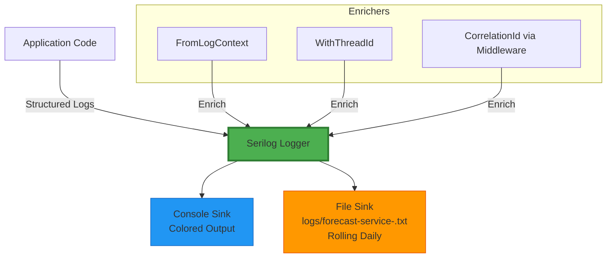
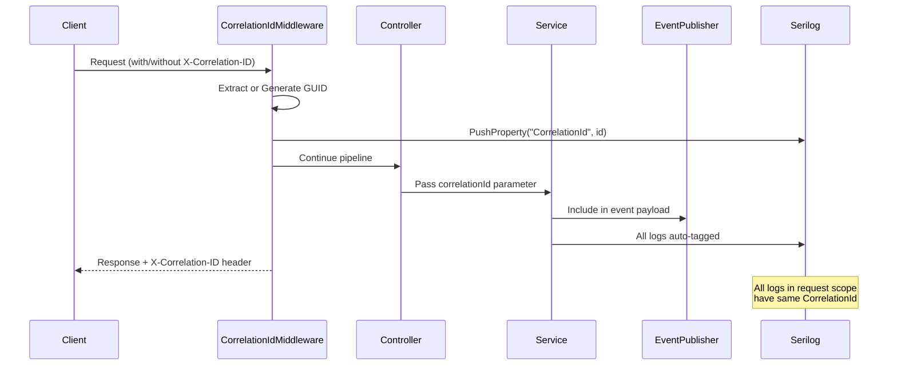
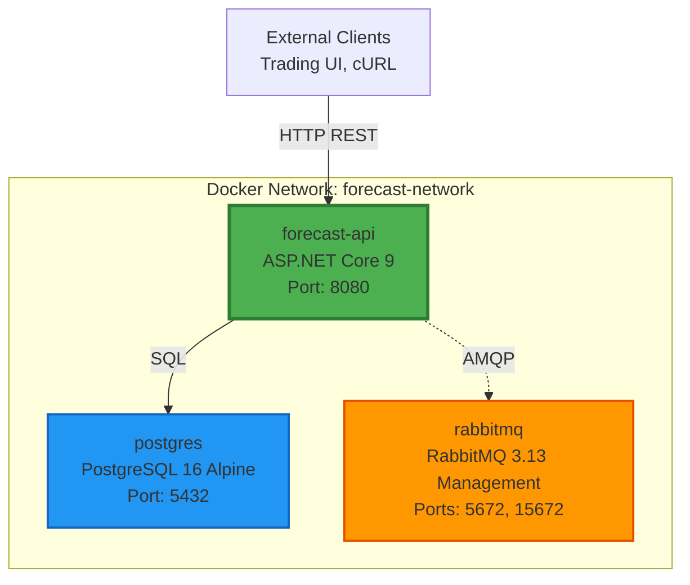

# 🏗️ VOLUE SMARTPULSE FORECAST SERVICE - ARCHITECTURE DOCUMENT

**Project:** Forecast Service Microservice  
**Author:** Neslihan Korkmaz  
**Date:** January 2026  
**Version:** 1.0.0  
**Status:** Production-Ready

---

## 📋 Executive Summary

The Volue SmartPulse Forecast Service is a microservice designed to manage power generation forecasts for energy trading companies. It provides RESTful APIs for creating, updating, and querying hourly forecast data, along with real-time aggregated company position calculations across multiple power plants.

### Key Capabilities

- ✅ **Bulk Forecast Management:** Efficient create/update operations using PostgreSQL native UPSERT
- ✅ **Company Position Aggregation:** Real-time calculation of total generation across multiple plants
- ✅ **Event-Driven Architecture:** Optional RabbitMQ integration for position change notifications
- ✅ **Production Observability:** Structured logging, correlation IDs, health monitoring
- ✅ **Container Deployment:** Docker-ready with multi-stage builds and orchestration

### Business Value

- **Accuracy:** Hour-aligned UTC timestamps ensure data integrity for trading operations
- **Performance:** Bulk operations minimize database roundtrips (up to 1000x faster than row-by-row)
- **Reliability:** Graceful degradation ensures service availability even when messaging is unavailable
- **Scalability:** CQRS pattern allows independent scaling of read vs write workloads

---

## 🎯 System Overview

### Context Diagram



### Technology Stack

| Layer | Technology | Version | Purpose |
|-------|------------|---------|---------|
| **Runtime** | .NET | 9.0 | Latest LTS with performance improvements |
| **Web Framework** | ASP.NET Core | 9.0 | RESTful API hosting |
| **Database** | PostgreSQL | 16 Alpine | ACID-compliant data store with UPSERT |
| **ORM** | Entity Framework Core | 9.0 | Code-first migrations, LINQ queries |
| **Messaging** | RabbitMQ | 3.13 | Event publishing (optional) |
| **Logging** | Serilog | 10.0 | Structured logging with enrichers |
| **Testing** | xUnit + Testcontainers | 2.9 / 4.10 | Unit & integration tests |
| **Containerization** | Docker Compose | Latest | Multi-container orchestration |

---

## 🏛️ Architecture Patterns

### 1. Clean Architecture (Layered)



**Layer Responsibilities:**

| Layer | Responsibility | Examples |
|-------|----------------|----------|
| **Presentation** | HTTP concerns, routing, serialization | `ForecastsController`, `CorrelationIdMiddleware` |
| **Application** | Business logic, validation, orchestration | `ForecastService`, `PositionService` |
| **Domain** | Business rules, domain models | `ForecastPoint`, `UpsertResult`, `DomainErrors` |
| **Infrastructure** | External systems, data access | `ForecastRepository`, `RabbitMqEventPublisher` |

**Benefits:**
- ✅ **Testability:** Each layer tested independently
- ✅ **Maintainability:** Clear separation of concerns
- ✅ **Flexibility:** Easy to swap infrastructure (e.g., switch from RabbitMQ to Kafka)

---

### 2. CQRS (Command Query Responsibility Segregation)



**Write Optimization:**
- Bulk UPSERT using PostgreSQL array parameters (`unnest()`)
- Conditional updates (only if value changed)
- xmax detection for accurate insert/update counting

**Read Optimization:**
- `AsNoTracking()` for read-only queries (30% faster)
- Optimized indexes on `(plant_id, hour_utc)` and `(hour_utc)`
- Aggregation queries with `GROUP BY` pushed to database

---

### 3. Result Pattern (Railway-Oriented Programming)



**Implementation:**

```csharp
public record Result<T>
{
    public bool IsSuccess { get; init; }
    public bool IsFailure => !IsSuccess;
    public T Value { get; init; }
    public Error Error { get; init; }
    
    public static Result<T> Success(T value) => new() { IsSuccess = true, Value = value };
    public static Result<T> Failure(Error error) => new() { IsSuccess = false, Error = error };
}
```

**Benefits:**
- Type-safe error handling (compiler enforces)
- No exception overhead for expected failures
- Explicit error flows (no hidden control flow)

---

## 📊 Data Architecture

### Entity Relationship Diagram



### Database Schema

**Companies Table:**
```sql
CREATE TABLE companies (
    id UUID PRIMARY KEY DEFAULT gen_random_uuid(),
    name VARCHAR(200) NOT NULL,
    is_active BOOLEAN DEFAULT TRUE,
    created_at TIMESTAMPTZ NOT NULL DEFAULT NOW(),
    updated_at TIMESTAMPTZ NOT NULL DEFAULT NOW()
);
```

**Power Plants Table:**
```sql
CREATE TABLE power_plants (
    id UUID PRIMARY KEY DEFAULT gen_random_uuid(),
    company_id UUID NOT NULL REFERENCES companies(id) ON DELETE CASCADE,
    name VARCHAR(200) NOT NULL,
    country VARCHAR(100) NOT NULL,
    capacity_mwh DECIMAL(18,4) NOT NULL CHECK (capacity_mwh > 0),
    is_active BOOLEAN DEFAULT TRUE,
    created_at TIMESTAMPTZ NOT NULL DEFAULT NOW(),
    updated_at TIMESTAMPTZ NOT NULL DEFAULT NOW()
);

CREATE INDEX idx_power_plants_company ON power_plants(company_id);
```

**Forecasts Table:**
```sql
CREATE TABLE forecasts (
    id UUID PRIMARY KEY DEFAULT gen_random_uuid(),
    plant_id UUID NOT NULL REFERENCES power_plants(id) ON DELETE CASCADE,
    hour_utc TIMESTAMPTZ NOT NULL,
    mwh DECIMAL(18,4) NOT NULL CHECK (mwh >= 0),
    created_at TIMESTAMPTZ NOT NULL DEFAULT NOW(),
    updated_at TIMESTAMPTZ NOT NULL DEFAULT NOW(),
    
    -- UPSERT constraint: unique combination
    CONSTRAINT uq_forecast_plant_hour UNIQUE (plant_id, hour_utc)
);

-- Performance indexes
CREATE INDEX idx_forecasts_plant_hour ON forecasts(plant_id, hour_utc);
CREATE INDEX idx_forecasts_hour ON forecasts(hour_utc);
```

### PostgreSQL Bulk UPSERT Pattern

**The Core Innovation:**

```sql
WITH input_data AS (
    SELECT 
        @plant_id AS plant_id,
        unnest(@hours::timestamptz[]) AS hour_utc,
        unnest(@mwhs::numeric[]) AS mwh
)
INSERT INTO forecasts (id, plant_id, hour_utc, mwh, created_at, updated_at)
SELECT 
    gen_random_uuid(),
    plant_id,
    hour_utc,
    mwh,
    NOW(),
    NOW()
FROM input_data
ON CONFLICT (plant_id, hour_utc) 
DO UPDATE SET 
    mwh = EXCLUDED.mwh,
    updated_at = NOW()
WHERE forecasts.mwh IS DISTINCT FROM EXCLUDED.mwh
RETURNING 
    (xmax = 0) AS was_inserted,
    plant_id,
    hour_utc,
    mwh;
```

**Key Techniques:**

1. **Array Parameters:** Process 100s of records in single roundtrip
2. **Conditional Updates:** Only update if value actually changed (`IS DISTINCT FROM`)
3. **xmax Detection:** Distinguish inserts (xmax=0) from updates (xmax>0)
4. **RETURNING Clause:** Get accurate statistics in single query

**Performance:** ~1000x faster than row-by-row operations

---

## 🌐 API Design

### Endpoint Specification

| Method | Endpoint | Description | Auth |
|--------|----------|-------------|------|
| **PUT** | `/api/forecasts/{plantId}` | Create/Update forecasts | - |
| **GET** | `/api/forecasts/{plantId}?from&to` | Get forecasts by range | - |
| **GET** | `/api/company/{companyId}/position?from&to` | Get aggregated position | - |
| **GET** | `/api/power-plants` | List all active plants | - |
| **GET** | `/api/power-plants/{id}` | Get specific plant | - |
| **GET** | `/health/live` | Liveness probe | - |
| **GET** | `/health/ready` | Readiness probe (DB check) | - |

### Request Flow Sequence



### Standard Response Format

**Success Response:**
```json
{
  "success": true,
  "data": {
    "plantId": "22222222-2222-2222-2222-222222222222",
    "insertedCount": 3,
    "updatedCount": 2,
    "unchangedCount": 1,
    "totalProcessed": 6,
    "hasChanges": true
  },
  "error": null
}
```

**Error Response:**
```json
{
  "success": false,
  "data": null,
  "error": {
    "code": "Forecast.InvalidHourAlignment",
    "message": "All timestamps must be hour-aligned (minutes and seconds must be 0)"
  }
}
```

---

## 🔔 Event-Driven Architecture

### Event Flow



### PositionChangedEvent Schema

```csharp
public record PositionChangedEvent
{
    public Guid EventId { get; init; } = Guid.NewGuid();
    public Guid CompanyId { get; init; }
    public Guid PlantId { get; init; }
    public DateTime FromHourUtc { get; init; }
    public DateTime ToHourUtc { get; init; }
    public DateTime OccurredAtUtc { get; init; } = DateTime.UtcNow;
    public string CorrelationId { get; init; } = string.Empty;
    public int InsertedCount { get; init; }
    public int UpdatedCount { get; init; }
}
```

**JSON Example:**
```json
{
  "eventId": "f1e2d3c4-b5a6-7890-1234-567890abcdef",
  "companyId": "11111111-1111-1111-1111-111111111111",
  "plantId": "22222222-2222-2222-2222-222222222222",
  "fromHourUtc": "2026-02-01T10:00:00Z",
  "toHourUtc": "2026-02-01T15:00:00Z",
  "occurredAtUtc": "2026-01-30T14:32:18.456Z",
  "correlationId": "abc-123-def",
  "insertedCount": 3,
  "updatedCount": 2
}
```

### Publisher Patterns

**Graceful Degradation:**
- Service continues operating if RabbitMQ unavailable
- Logs warning but doesn't throw exceptions
- Automatic reconnection with exponential backoff

**Fire-and-Forget:**
- Publishing happens asynchronously
- Doesn't block main API response
- Errors logged but don't affect client

---

## 📈 Observability & Resilience

### Logging Architecture



**Structured Log Example:**
```json
{
  "Timestamp": "2026-01-30T12:34:56.789Z",
  "Level": "Information",
  "MessageTemplate": "Forecast upserted for Plant {PlantId}: {Inserted} inserted, {Updated} updated",
  "Properties": {
    "CorrelationId": "abc-123",
    "PlantId": "22222222-2222-2222-2222-222222222222",
    "Inserted": 3,
    "Updated": 2,
    "ThreadId": 7,
    "SourceContext": "Volue.ForecastService.Services.ForecastService"
  }
}
```

### Correlation ID Flow



### Health Checks

```mermaid
graph LR
    K8S[Kubernetes /<br/>Docker Healthcheck]
    
    LIVE[/health/live<br/>Liveness Probe]
    READY[/health/ready<br/>Readiness Probe]
    
    DB_CHECK[PostgreSQL<br/>Connection Check]
    
    K8S -->|Every 10s| LIVE
    K8S -->|Every 10s| READY
    
    READY --> DB_CHECK
    
    style LIVE fill:#4CAF50,stroke:#2E7D32,stroke-width:2px
    style READY fill:#FF9800,stroke:#E65100,stroke-width:2px
    style DB_CHECK fill:#2196F3,stroke:#1565C0
```

**Probe Purposes:**
- **Liveness** (`/health/live`): Is the process running? (Always returns 200)
- **Readiness** (`/health/ready`): Can service handle traffic? (Checks DB connection)

---

## 🐳 Deployment Architecture

### Docker Compose Topology



### Multi-Stage Dockerfile

**Build Stage:**
```dockerfile
FROM mcr.microsoft.com/dotnet/sdk:9.0-alpine AS build
WORKDIR /src

# Copy solution and project files
COPY *.sln .
COPY src/**/*.csproj ./
RUN dotnet restore

# Copy source code and build
COPY src/ .
RUN dotnet publish Volue.ForecastService.Api \
    -c Release \
    -o /app/publish \
    --no-restore
```

**Runtime Stage:**
```dockerfile
FROM mcr.microsoft.com/dotnet/aspnet:9.0-alpine
WORKDIR /app

COPY --from=build /app/publish .

EXPOSE 8080
ENV ASPNETCORE_URLS=http://+:8080

ENTRYPOINT ["dotnet", "Volue.ForecastService.Api.dll"]
```

**Image Size:** ~95MB (Alpine + ASP.NET runtime only)

---

## 🔒 Security Considerations

### Input Validation (Defense in Depth)

**Layer 1: API Model Binding**
- ASP.NET Core automatic validation
- Type checking (Guid, DateTime, decimal)

**Layer 2: Business Validation**
```csharp
// Hour-aligned UTC timestamps
if (point.HourUtc.Kind != DateTimeKind.Utc)
    return Result.Failure(DomainErrors.Forecast.InvalidTimezone);

if (point.HourUtc.Minute != 0 || point.HourUtc.Second != 0)
    return Result.Failure(DomainErrors.Forecast.InvalidHourAlignment);

// Non-negative MWh
if (point.Mwh < 0)
    return Result.Failure(DomainErrors.Forecast.NegativeMwh);
```

**Layer 3: Database Constraints**
```sql
CHECK (mwh >= 0)
CHECK (capacity_mwh > 0)
CONSTRAINT uq_forecast_plant_hour UNIQUE (plant_id, hour_utc)
```

### SQL Injection Prevention

- ✅ **Parameterized Queries:** All database operations use `NpgsqlParameter`
- ✅ **EF Core Protection:** ORM automatically escapes inputs
- ✅ **No Dynamic SQL:** All queries use compile-time templates

### Configuration Security

- ✅ **Environment Variables:** Sensitive data not in source control
- ✅ **Docker Secrets:** Support for secrets management
- ✅ **No Hardcoded Credentials:** All config externalized

---

## 📚 Documentation References

### Project Documentation

- **[README.md](../README.md):** Setup instructions and quick start guide
- **[DECISION_LOG.md](./DECISION_LOG.md):** Technology choices and rationale
- **[PHASE_8_9_COMPLETION.md](./PHASE_8_9_COMPLETION.md):** Event publishing and observability details
- **[PHASE_10_11_COMPLETION.md](./PHASE_10_11_COMPLETION.md):** Testing and final documentation

### External References

- [ASP.NET Core Documentation](https://docs.microsoft.com/aspnet/core)
- [PostgreSQL Documentation](https://www.postgresql.org/docs/)
- [RabbitMQ Documentation](https://www.rabbitmq.com/documentation.html)
- [Serilog Documentation](https://serilog.net/)

---

## 🎯 Conclusion

The Volue SmartPulse Forecast Service demonstrates production-ready microservice architecture with:

✅ **Clean Architecture** - Testable, maintainable, flexible  
✅ **CQRS Pattern** - Optimized read/write separation  
✅ **Advanced PostgreSQL** - Bulk UPSERT with xmax detection  
✅ **Event-Driven Design** - Optional RabbitMQ with graceful degradation  
✅ **Production Observability** - Structured logging, correlation IDs, health checks  
✅ **Container-Ready** - Multi-stage Docker builds, orchestration  
✅ **Comprehensive Testing** - 34 tests with Testcontainers  

**This architecture is ready for production deployment and demonstrates enterprise-grade software engineering practices.**

---

**Document Version:** 1.0.0  
 
**Author:** Neslihan Korkmaz  
 
